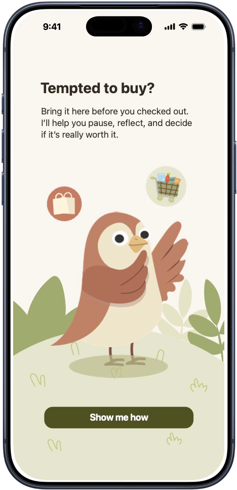
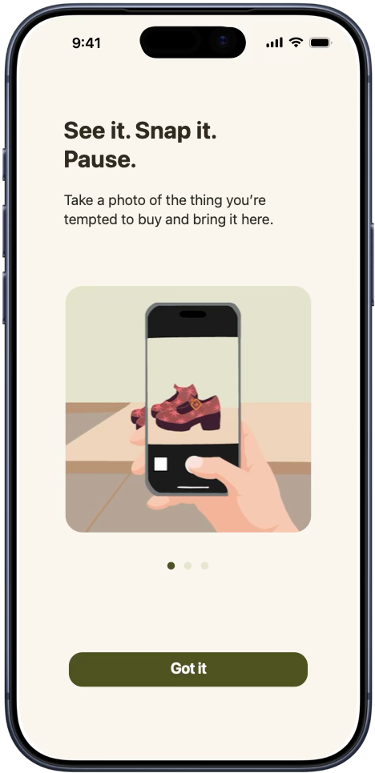
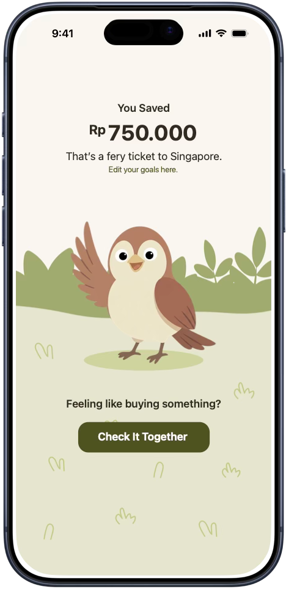
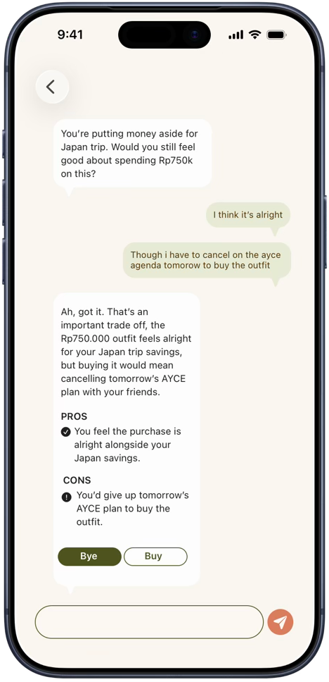
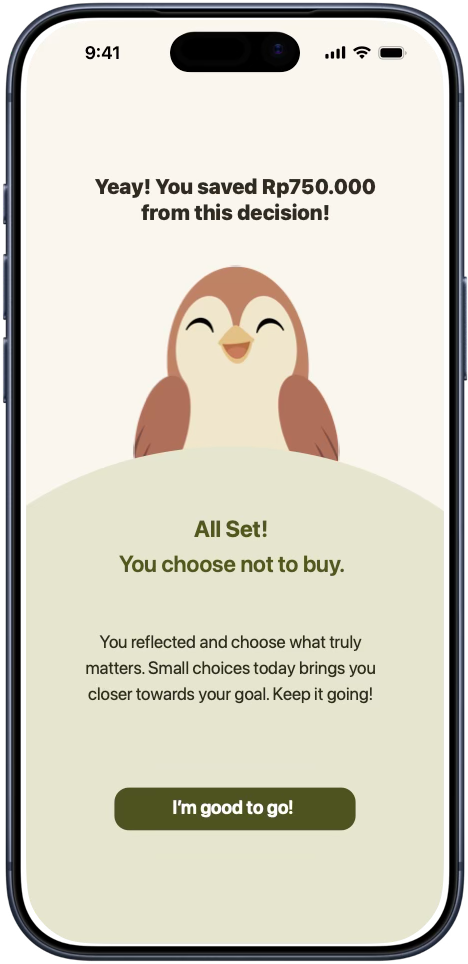
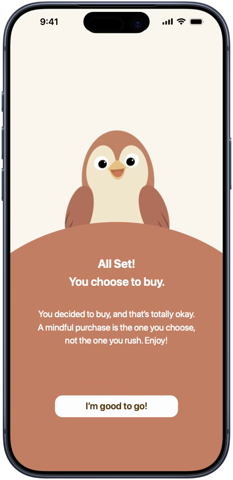

# Buydee

Buydee is an app that helps people who experience post-purchase regret break impulsive buying cycles and make intentional shopping choices by providing a guided conversation that encourages mindful consideration before making a purchase.

## 🧠 Background

People who recognize their tendency toward impulsive buying may want to make more intentional purchasing decisions, but often act on the initial urge before taking a moment to reconsider. They need supportive guidance that helps them pause, reflect, and consider another perspective before deciding whether a purchase is truly worth it to them.

## ✨ Features / Key Features

### 💬 AI Companion Chat

A reflective conversation that helps users rethink their purchase decisions before acting.

### 🎯 Goal-Based Savings Comparison

Compares spending decisions with progress toward the user's goals.

## 🛠 Tech Stack

- SwiftUI
- SwiftData
- AVFoundation
- PhotosUI
- LLM

## 📷 Screenshots

    
    
    
    
    
    
    

## 👥 Team Members

- Anita Rutmala
- Angelic Pangkaraya
- Athirah Aura Rahmawati
- Desy Leviana
- Ikzaaz Bakhtar Abdurrahman
- Iyan Putri Evrilia
- Marzandi Zahran Leta
- Muhammad Fathariq Dimas Octaviandra
- Muhammad Muttakin
- Zildjian Vito Sulaiman

